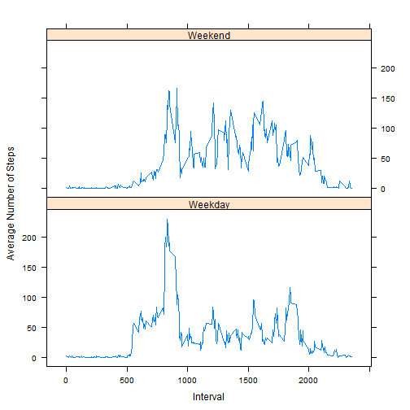

# Introduction
It is now possible to collect a large amount of data about personal movement using activity monitoring devices such as a Fitbit, Nike Fuelband, or Jawbone Up. These types of devices are part of the "quantified self" movement - a group of enthusiasts who take measurements about themselves regularly to improve their health, to find patterns in their behavior, or because they are tech geeks. But these data remain under-utilized both because the raw data are hard to obtain and there is a lack of statistical methods and software for processing and interpreting the data.

This assignment makes use of data from a personal activity monitoring device. This device collects data at 5 minute intervals through out the day. The data consists of two months of data from an anonymous individual collected during the months of October and November, 2012 and include the number of steps taken in 5 minute intervals each day.

# Data

The data for this assignment can be downloaded from the course web
site:

* Dataset: [Activity monitoring data](https://d396qusza40orc.cloudfront.net/repdata%2Fdata%2Factivity.zip) [52K]

The variables included in this dataset are:

* **steps**: Number of steps taking in a 5-minute interval (missing
    values are coded as `NA`)

* **date**: The date on which the measurement was taken in YYYY-MM-DD
    format

* **interval**: Identifier for the 5-minute interval in which
    measurement was taken


The dataset is stored in a comma-separated-value (CSV) file and there
are a total of 17,568 observations in this
dataset.

## Loading and preprocessing the data
This code will validate the present of the data files. If the data file is not present, it will download the data from target URL. 


### Please note
  1. This R programmed in Windows Environment.
  2. Working directory in "C:/ReproducibleResearch/RepData_PeerAssessment1/". Please create this folder if it is not present. 


```r
###LoadData
## Set working directory
setwd("C:/ReproducibleResearch/RepData_PeerAssessment1/")


if(!file.exists("activity.csv")) {
  temp <- tempfile()
  download.file("http://d396qusza40orc.cloudfront.net/repdata%2Fdata%2Factivity.zip",temp)
  unzip(temp)
  unlink(temp)

}
cat("DataFile downloaded in ", getwd()) #saving to working directory
```

```
## DataFile downloaded in  C:/ReproducibleResearch/RepData_PeerAssessment1
```

```r
activity <- read.csv("activity.csv")
activityCopy <- activity

# Convert date to date class
activity$Date <- as.Date(activity$date, "%Y-%m-%d")
uniqueDates <- unique(activity$Date)

# Convert interval to a factor
activity$interval <- as.factor(activity$interval)

# Exrtract levels of 5-min intervals
l <- levels(activity$interval)
uniqueIntervals <- unique(activity$interval)
```

### Total Number of steps taken per day


```r
totalSteps <- tapply(activity$steps, activity$date, sum, na.rm = T)
avgSteps <- tapply(activity$steps, activity$date, mean, na.rm = T)

hist(totalSteps, breaks = 10, col = "red", main = "Total Number of steps each day", 
    xlab = "Total Number of Steps each day")
```

 

#### Calculate and report the mean and median of the total number of steps taken per day

The mean Steps Per Day are 

```r
# First split up the data frame for steps by day
stepsSplit <- split(activity$steps, activity$Date)
meanStepsPerDay <- sapply(stepsSplit, mean, na.rm = TRUE)
meanDataFrame <- data.frame(Date = uniqueDates, MeanStepsperDay = meanStepsPerDay, 
    row.names = NULL)
meanDataFrame
```

```
##          Date MeanStepsperDay
## 1  2012-10-01             NaN
## 2  2012-10-02       0.4375000
## 3  2012-10-03      39.4166667
## 4  2012-10-04      42.0694444
## 5  2012-10-05      46.1597222
## 6  2012-10-06      53.5416667
## 7  2012-10-07      38.2465278
## 8  2012-10-08             NaN
## 9  2012-10-09      44.4826389
## 10 2012-10-10      34.3750000
## 11 2012-10-11      35.7777778
## 12 2012-10-12      60.3541667
## 13 2012-10-13      43.1458333
## 14 2012-10-14      52.4236111
## 15 2012-10-15      35.2048611
## 16 2012-10-16      52.3750000
## 17 2012-10-17      46.7083333
## 18 2012-10-18      34.9166667
## 19 2012-10-19      41.0729167
## 20 2012-10-20      36.0937500
## 21 2012-10-21      30.6284722
## 22 2012-10-22      46.7361111
## 23 2012-10-23      30.9652778
## 24 2012-10-24      29.0104167
## 25 2012-10-25       8.6527778
## 26 2012-10-26      23.5347222
## 27 2012-10-27      35.1354167
## 28 2012-10-28      39.7847222
## 29 2012-10-29      17.4236111
## 30 2012-10-30      34.0937500
## 31 2012-10-31      53.5208333
## 32 2012-11-01             NaN
## 33 2012-11-02      36.8055556
## 34 2012-11-03      36.7048611
## 35 2012-11-04             NaN
## 36 2012-11-05      36.2465278
## 37 2012-11-06      28.9375000
## 38 2012-11-07      44.7326389
## 39 2012-11-08      11.1770833
## 40 2012-11-09             NaN
## 41 2012-11-10             NaN
## 42 2012-11-11      43.7777778
## 43 2012-11-12      37.3784722
## 44 2012-11-13      25.4722222
## 45 2012-11-14             NaN
## 46 2012-11-15       0.1423611
## 47 2012-11-16      18.8923611
## 48 2012-11-17      49.7881944
## 49 2012-11-18      52.4652778
## 50 2012-11-19      30.6979167
## 51 2012-11-20      15.5277778
## 52 2012-11-21      44.3993056
## 53 2012-11-22      70.9270833
## 54 2012-11-23      73.5902778
## 55 2012-11-24      50.2708333
## 56 2012-11-25      41.0902778
## 57 2012-11-26      38.7569444
## 58 2012-11-27      47.3819444
## 59 2012-11-28      35.3576389
## 60 2012-11-29      24.4687500
## 61 2012-11-30             NaN
```


```r
medianStepsPerDay <- sapply(stepsSplit, median, na.rm = TRUE)
medianDataFrame <- data.frame(date = uniqueDates, MedianStepsPerDay = medianStepsPerDay, 
    row.names = NULL)
medianDataFrame
```

```
##          date MedianStepsPerDay
## 1  2012-10-01                NA
## 2  2012-10-02                 0
## 3  2012-10-03                 0
## 4  2012-10-04                 0
## 5  2012-10-05                 0
## 6  2012-10-06                 0
## 7  2012-10-07                 0
## 8  2012-10-08                NA
## 9  2012-10-09                 0
## 10 2012-10-10                 0
## 11 2012-10-11                 0
## 12 2012-10-12                 0
## 13 2012-10-13                 0
## 14 2012-10-14                 0
## 15 2012-10-15                 0
## 16 2012-10-16                 0
## 17 2012-10-17                 0
## 18 2012-10-18                 0
## 19 2012-10-19                 0
## 20 2012-10-20                 0
## 21 2012-10-21                 0
## 22 2012-10-22                 0
## 23 2012-10-23                 0
## 24 2012-10-24                 0
## 25 2012-10-25                 0
## 26 2012-10-26                 0
## 27 2012-10-27                 0
## 28 2012-10-28                 0
## 29 2012-10-29                 0
## 30 2012-10-30                 0
## 31 2012-10-31                 0
## 32 2012-11-01                NA
## 33 2012-11-02                 0
## 34 2012-11-03                 0
## 35 2012-11-04                NA
## 36 2012-11-05                 0
## 37 2012-11-06                 0
## 38 2012-11-07                 0
## 39 2012-11-08                 0
## 40 2012-11-09                NA
## 41 2012-11-10                NA
## 42 2012-11-11                 0
## 43 2012-11-12                 0
## 44 2012-11-13                 0
## 45 2012-11-14                NA
## 46 2012-11-15                 0
## 47 2012-11-16                 0
## 48 2012-11-17                 0
## 49 2012-11-18                 0
## 50 2012-11-19                 0
## 51 2012-11-20                 0
## 52 2012-11-21                 0
## 53 2012-11-22                 0
## 54 2012-11-23                 0
## 55 2012-11-24                 0
## 56 2012-11-25                 0
## 57 2012-11-26                 0
## 58 2012-11-27                 0
## 59 2012-11-28                 0
## 60 2012-11-29                 0
## 61 2012-11-30                NA
```
The median measure may look a bit puzzling, but if you observe the data for the amount of steps over some of the days, you will see that a majority of the steps taken are zero and so the mean would logically represent the 50 percentile. Nevertheless , median of total steps given better observation to the data set as below:


```r
median(totalSteps, na.rm=TRUE)
```

```
## [1] 10395
```

## Average daily activity pattern
What we now need to do is split up this data again so that individual data frames represent the steps taken over each time interval. As such, there will be a data frame for interval 5, another data frame for interval 10 and so on. Once we extract out these individual data frames, we thus compute the mean for each time interval. It is imperative to note that we again will ignore NA values. We will thus plot the data as a time-series plot (of type="l"). Once we have done this, we will locate where in the time-series plot the maximum is located and will draw a red vertical line to denote this location:

### Plot Data Set


```r
# Find the average number of steps grouped by intereval
Steps = tapply(activity$steps, activity$interval, mean, na.rm = T)

# Convert levels of intervals into numeric
Interval <- as.numeric(l)

# Create the dataframe df of the Interval and Steps columns
df <- data.frame(Steps, Interval)
```


Which 5-minute interval, on average across all the days in the dataset, contains the maximum number of steps?

```r
# Plot 
library(ggplot2)
```

```
## Warning: package 'ggplot2' was built under R version 3.2.1
```

```r
g <- ggplot(df, aes(Interval, Steps))

g + geom_line(colour = "blue") + ggtitle("Time Series Plot of the 5-minute Interval\n and the Average Number of Steps,\n Taken across all Days") +ylab ("Average Number of Steps") + geom_vline(xintercept = df[which.max(Steps), 2 ],colour="green")
```

 
The Maximum number of steps is 

```r
# Display the Max value
maxInterval<-df[which.max(Steps), ]
maxInterval
```

```
##        Steps Interval
## 835 206.1698      835
```
## Imputing missing values

There are many days/intervals where there are missing values (coded as NA). The presence of missing days may introduce bias into some calculations or summaries of the data.

### Calculate Missing Values


```r
missing <- is.na(activityCopy$steps)
# How many missing
table(missing)
```

```
## missing
## FALSE  TRUE 
## 15264  2304
```
There are 2304 Missing Data Values.


```r
# Impute data using the mice (multivariate imputation chains equation)
library(mice)
```

```
## Warning: package 'mice' was built under R version 3.2.1
```

```
## Loading required package: Rcpp
```

```
## Warning: package 'Rcpp' was built under R version 3.2.1
```

```
## Loading required package: lattice
## mice 2.22 2014-06-10
```

```r
set.seed(144)
# imputedData <- complete(mice(activity)) Number of total steps each day
# after imputation a.out <- amelia(activityCopy, cs='date', m=1) Data frame
# after imputing a <- a.out$imputations$imp1 totStepsImp <- tapply(a$steps,
# a$date, sum)


# Impute by replacing NA by the mean of steps
activityCopy$steps[is.na(activityCopy$steps)] <- tapply(activityCopy$steps, 
    activityCopy$interval, mean, na.rm = TRUE)
# Number of total steps each day
totStepsImp <- tapply(activityCopy$steps, activityCopy$date, sum)

# Summary statistics before and after imputing
summary(totalSteps)
```

```
##    Min. 1st Qu.  Median    Mean 3rd Qu.    Max. 
##       0    6778   10400    9354   12810   21190
```


```r
summary(totStepsImp)
```

```
##    Min. 1st Qu.  Median    Mean 3rd Qu.    Max. 
##      41    9819   10770   10770   12810   21190
```
There does not seem to be a significant difference in the average number of total steps each day before and after imputing. 


More information about the mice and Amelia packages can be found here [mice][1] and here [amelia][2]

  [1]: http://doc.utwente.nl/78938/1/Buuren11mice.pdf
  [2]: http://cran.r-project.org/web/packages/Amelia/vignettes/amelia.pdf


## Compare total number of steps each day before and after imputing

```r
hist(totalSteps, col = "red", xlab = "Average Total Number of Steps Before Imputing", 
    main = "", breaks = 10)
title("Distribution of the total Number of steps\n each day Before and After Imputing")
```

 

```r
hist(totStepsImp, col = "cyan", main = "", xlab = "Average Total Number of Steps After Imputing", 
    breaks = 10)
```

 

## Are there differences in activity patterns between weekdays and weekends?


```r
# Extract weekdays
activityCopy$Days <- weekdays(as.Date(as.character(activityCopy$date)))
# Create a logical vector d where Days are Saturday or Sunday
d <- activityCopy$Days == "Saturday" | activityCopy$Days == "Sunday"
# Call Saturday and Sunday Weekend
activityCopy$Days[d] = "Weekend"
# Call weekdays (Monday through Friday) Weekdays
activityCopy$Days[!d] = "Weekday"

# Weekdays
activityCopyWD <- activityCopy[activityCopy$Days == "Weekday", ]
# Weekend
activityCopyWE <- activityCopy[activityCopy$Days == "Weekend", ]
# Convert levels of interval into numeric for weekdays
IntervalWD <- as.numeric(levels(as.factor(activityCopyWD$interval)))
# Convert levels of interval into numeric for the weekend
IntervalWE <- as.numeric(levels(as.factor(activityCopyWE$interval)))
# Average number of steps during weekdays
avgWD <- tapply(activityCopyWD$steps, activityCopyWD$interval, mean)
# Average number of steps during the weekend
avgWE <- tapply(activityCopyWE$steps, activityCopyWE$interval, mean)
# Data frame combining average number of steps and interval during weekdays
dfWD <- data.frame(avgWD, IntervalWD)
# Data frame combining average number of steps and interval during the
# weekend
dfWE <- data.frame(avgWE, IntervalWE)
# Convert Days into factor activityCopy$Days <- as.factor(activityCopy$Days)

# activityCopy$interval <- factor(activityCopy$interval)
```


```r
# Use base plot
plot(dfWD$IntervalWD, dfWD$avgWD, type = "l", main = "Comparison of the Average Number of Steps\n between Weekdays and the Weekend", 
    xlab = "Interval", ylab = "Number of Steps")
lines(dfWE$IntervalWE, dfWE$avgWE, col = "red")
legend("topright", c("Weekday", "Weekend"), col = c("black", "red"), lty = 1)
```

 


```r
# Use the lattice Package

# Add a column to the data frames that include weekdays and weekend days
dfWD$wDays <- rep("Weekday", nrow(dfWD))
dfWE$wDays <- rep("Weekend", nrow(dfWD))
# Rename column names to match
colnames(dfWD) <- c("Steps", "Interval", "wDays")
colnames(dfWE) <- c("Steps", "Interval", "wDays")
# rbind the dataframes
df <- rbind(dfWD, dfWE)
# Convert wDays column into a factor
df$wDays <- factor(df$wDays)

# Use lattice library to plot
library(lattice)
xyplot(Steps ~ Interval | wDays, data = df, type = "l", layout = c(1, 2), ylab = "Average Number of Steps")
```

 


```r
# Using ggplot2 package
g <- ggplot(df, aes(Interval, Steps, fill = wDays, colour = wDays))
g + geom_line() + labs(colour = "") + ggtitle("Comparison of the Average Number of Steps\n between Weekdays and Weekend") + ylab("Average Number of Steps")
```

 


## Conclusion
Although the maximum average number of steps during weekdays is higher than that during the weekend, there seems to be on average more activities during the weekend. However, in both weekdays and weekend, most activities seem to take place between 8:30 and 9:30 in the morning. Also, there seems to be no activities between midnight and 5:00 AM throughout the week. Moreover, there are on average more activities during the weekend between 10:00 AM and 8:00 PM. 
